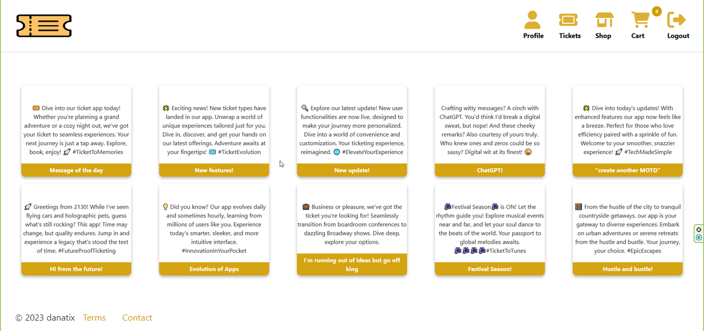
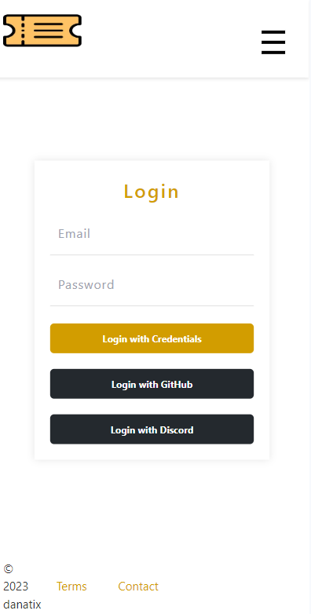

## DanaTix Full-Stack project

A simple lightweight full-stack app to purchase and manage public transportation tickets

### Frontend

* Next.js 13

### Backend

* Java Spring Boot
* MySQL

### Features:

The user should be able to:

* Register
* Login
* Edit profile
* Purchase tickets or passes
* Validate tickets or passes
* View news/announcements... which might contain information about delays... on our imaginary public transportation network
* Be able to do all that using his/her mobile too

The backend and frontend parts of the application communicate using REST API endpoints, and we want to ensure that the information sent is secure.

### Security

Backend security features:
* CORS filter
* JWT filter
* Email verification filter

Frontend security features:
* Authorization with middleware

The project includes both unit and integration tests

# Other requirements

* Node.js 16.14 or later
* yarn
* gradle
* patience to set up all other enviroment variables, oauth keys.:)